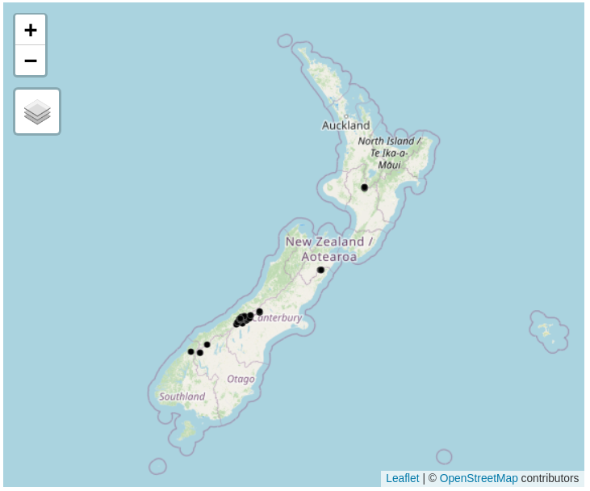
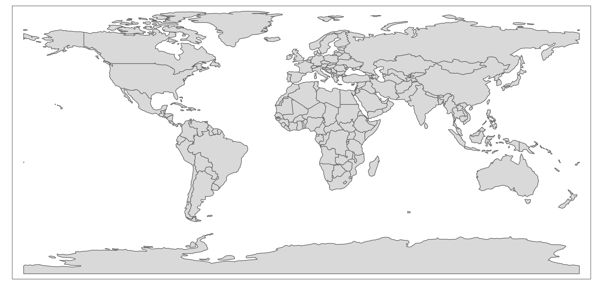

```{r, eval=FALSE, echo=FALSE}
remotes::install_cran("pagedown")
file.remove("report.pdf")
pagedown::chrome_print("report.html")
tinytex::install_tinytex()
```


```{r setup, include=FALSE}
knitr::opts_chunk$set(echo = TRUE, fig.width = 3)
```

A report has found ... [@grange2014cycleways].

# Set-up

I used the following packages...

```{r, message=FALSE}
library(tidyverse)
library(spData)
library(sf)
```


## Test

See Figure \@ref(fig:cars).


```{r cars, fig.cap="Here is a plot.", echo=FALSE, fig.show='hold'}
plot(1:9)
plot(nz)
```

```{r message, message=TRUE}
message("hello")
```


# Results

```{r, fig.width=6, echo=FALSE}
nz
class(nz)
plot(nz)
library(tmap)
# tmap_mode("view")
# tm_shape(nz) + tm_polygons() +
#   tm_shape(nz_height) + tm_dots() 

```

A plot of London:

```{r, eval=FALSE}
u = "https://opendata.arcgis.com/datasets/20c72bd4669a487c9d24b0e3fe7ea93b_0.kml"
# u = "https://github.com/sjwhitworth/london_geojson/raw/master/london_postcodes.json"
london = read_sf(u)
# london = read_sf("london_postcodes.json")
tm_shape(london) + tm_polygons()
```


```{r}

```


# References


